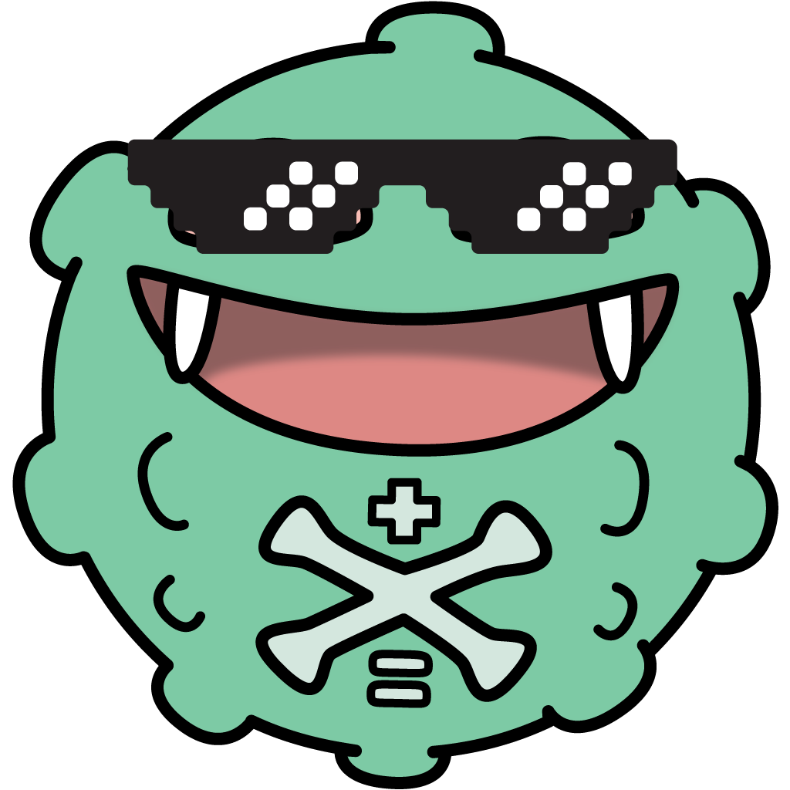

<p align="center">
  
</p>

<h1 align="center">
  <code>showdex</code>
</h1>

<table align="center">
  <thead>
    <tr>
      <th align="center">&nbsp;Current <a href="https://github.com/doshidak/showdex/releases/tag/v1.2.3">v1.2.3</a>&nbsp;</th>
      <th align="center">&nbsp;Install on <a href="https://chrome.google.com/webstore/detail/dabpnahpcemkfbgfbmegmncjllieilai">Chrome</a> · <a href="https://chrome.google.com/webstore/detail/dabpnahpcemkfbgfbmegmncjllieilai">Opera</a> · <a href="https://addons.mozilla.org/en-US/firefox/addon/showdex">Firefox</a> · <a href="https://apps.apple.com/us/app/enhanced-tooltips-for-showdown/id1612964050">Safari</a>&nbsp;</th>
      <th align="center">&nbsp;Discuss on <a href="https://smogon.com/forums/threads/showdex-an-auto-updating-damage-calculator-built-into-showdown.3707265">Smogon</a> · <a href="https://discord.gg/2PXVGGCkm2">Discord</a></th>
    </tr>
  </thead>
</table>

<br>

**Showdex** is a browser extension for [Pokémon Showdown](https://pokemonshowdown.com) that brings the [Damage Calculator](https://calc.pokemonshowdown.com) you know & love right into your battle! Automatically syncs all Pokémon & field conditions as you play, so you can spend *less time* shitting brix & *more time* [hitting kicks](https://smogon.com/dex/sv/moves/high-jump-kick).

<br>

Officially supported on [**Chrome**](https://chrome.google.com/webstore/detail/dabpnahpcemkfbgfbmegmncjllieilai) (+ any native [**Chromium**](https://chromium.org/Home) browser, like **Edge** & **Brave**), [**Opera**](https://addons.opera.com/en/extensions/details/showdex) & [**Firefox**](https://addons.mozilla.org/en-US/firefox/addon/showdex).

<details>
  <summary>
    <strong>
      &nbsp;&nbsp;༼ つ ಥ_ಥ ༽つ&nbsp;&nbsp;Safari
    </strong>
    &nbsp;...?
  </summary>

  ---
  Despite [Apple requiring us to shell out $100/year for the Apple Developer Program](https://developer.apple.com/documentation/safariservices/safari_web_extensions) just to distribute a singular *free* extension on the App Store, thanks to the many generous contributions from the awesome Showdown community over the years, we're now planning on officially supporting Showdex on iOS & macOS in the future!

  In the meantime, [**Enhanced Tooltips for Showdown**](https://apps.apple.com/us/app/enhanced-tooltips-for-showdown/id1612964050) ([Source on GitHub](https://github.com/cbruegg/Enhanced-Tooltips-for-Showdown)), currently available on the App Store, bundles Showdex along with the [Enhanced Tooltips](https://github.com/rowin1/Pokemon-Showdown-Enhanced-Tooltips) & [Randbats Tooltip](https://github.com/pkmn/randbats) extensions. Note that the bundled Showdex is not officially supported, so questions regarding Showdex running on Safari should be directed towards the maintainer of the aforementioned App Store app, [Christian Brüggemann](https://cbruegg.com/enhanced-tooltips-for-showdown-support) ([Smogon](https://smogon.com/forums/members/cbruegg.585763) · [GitHub](https://github.com/cbruegg)).  

  [Would you like to know more?](https://smogon.com/forums/threads/showdex-an-auto-updating-damage-calculator-built-into-showdown.3707265/post-9368925)
  | --- |
  ---
</details>

<br>

<h3 align="center">
  Navigation
</h3>

<table align="center">
  <thead>
    <tr>
      <th>&nbsp;<a href="https://github.com/users/doshidak/projects/1">Planned Features</a>&nbsp;</th>
      <th>&nbsp;<a href="https://github.com/users/doshidak/projects/2">Known Bugs</a>&nbsp;</th>
    </tr>
  </thead>
</table>

<table align="center">
  <thead>
    <tr>
      <th>&nbsp;<a href="#issues">Suggest a Feature</a>&nbsp;</th>
      <th>&nbsp;<a href="#issues">Report a Bug</a>&nbsp;</th>
      <th>&nbsp;<a href="#--contributing">Contribute/Translate</a>&nbsp;</th>
    </tr>
  </thead>
</table>

<br>
<br>

<h1 align="center">
  Developer Zone
</h1>

> **Warning**  
> You are about to get in the zone, the developer zone.  
> If you do not wish to get in the zone, the developer zone, please visit the [**Smogon Forums post**](https://smogon.com/forums/threads/showdex-an-auto-updating-damage-calculator-built-into-showdown.3707265/) instead.

<br>

## Developer SparkNotes™

> **Note**  
> This section is a work-in-progress.

This extension is written in **TypeScript**, which is essentially [JavaScript on crack](https://github.com/doshidak/showdex/blob/fb08da8ec3352c0efbb506551979e2073358783a/src/redux/factories/buildPresetQuery.ts#L98-L120), using:

* **React** for the UI frontend (e.g., [Hellodex](./src/pages/Hellodex/Hellodex.tsx), [Calcdex](./src/pages/Calcdex/Calcdex.tsx)),
* **Redux** for global state management (e.g., [Calcdex state](./src/redux/store/calcdexSlice.ts)),
* [**RTK Query**](https://redux-toolkit.js.org) for global data management (e.g., [downloaded Smogon sets](./src/redux/services/presetApi.ts)),
* **Babel** for TypeScript transpilation (in lieu of [`tsc`](https://typescriptlang.org/docs/handbook/compiler-options.html)),
* **ESLint** for *suggestive* code linting, and
* **webpack** for chunking & bundling.

<details>
  <summary>
    <table>
      <thead>
        <tr>
          <th>&nbsp;How It's Made™&nbsp;</tm>
        </tr>
      </thead>
    </table>
  </summary>

  ---

  > **Note**  
  > More information coming soon!

  [uhhhhhhhhh](https://youtube.com/watch?v=GcSfbaac9eg&t=29s)

  ---
  <br>
</details>

### Requirements

> **Warning**
> Due to the removal of `--experimental-specifier-resolution=node` starting in `node` v19, v18 is **required** (i.e., `^18.0.0`) to build this project. Use something like [`nvm`](https://github.com/nvm-sh/nvm) to install v18 (`nvm install lts/hydrogen`) alongside your current `node` installation.

* **`node`** LTS Hydrogen v18
* **`yarn`** Classic v1.22.0+
* **`bash`** ([Windows WSL](https://docs.microsoft.com/en-us/windows/wsl/install), macOS, or Linux)

<br>

## ①&nbsp;&nbsp;Setup

> **Note**  
> If your browser is already configured for extension development, you can skip this part. If you're building for `'standalone'`, **don't** skip this part.

When building this as an extension (i.e., the `BUILD_TARGET` env is either `'chrome'` or `'firefox'`), you'll need to apply some slight tweaks to your browser in order to directly install extensions from your local disk.

<details>
  <summary>
    &nbsp;<strong>Google Chrome</strong>
  </summary>

  ---

  1. Navigate to the **Chrome extensions** page (`chrome://extensions`).
  2. Enable **Developer mode** in the top-right corner.
  3. Verify that the **Load unpacked** option is available.

  ---
</details>

<details>
  <summary>
    &nbsp;<strong>Mozilla Firefox</strong>
  </summary>

  ---

  1. Navigate to the **Advanced Preferences** page (`about:config`).
  2. Search for the preference `xpinstall.signatures.required`.
  3. Set the preference's value to `false` (typically `true` by default).
  4. Navigate to the **Debugging** page (`about:debugging`).
  5. Select **This Firefox** on the left-hand panel.
  6. Verify that the **Temporary Extensions** section and the **Load Temporary Add-on...** option are available.

  ---
</details>

<details>
  <summary>
    &nbsp;<strong>Mozilla Firefox for Android</strong>
  </summary>

  ---

  > **Note**  
  > More information coming soon!  
  > Though instructions aren't currently provided, this project supports [developing on **Firefox for Android Nightly**](https://extensionworkshop.com/documentation/develop/developing-extensions-for-firefox-for-android).

  For now, see [these instructions from Mozilla](https://extensionworkshop.com/documentation/develop/developing-extensions-for-firefox-for-android/#set-up-your-computer-and-android-emulator-or-device) for setting up your Android device and **Firefox for Android Nightly** installation for extension development.

  ---
</details>

When building in `'standalone'` mode (for embedding Showdex into your own [`pokemon-showdown-client`](https://github.com/smogon/pokemon-showdown-client)), you'll need to mimic what the [`content`](./src/content.ts) script does in your client's [`index.html`](https://github.com/smogon/pokemon-showdown-client/blob/cd181c26946136a3118582b0176fd83c88726e33/play.pokemonshowdown.com/index.template.html) file.

<details>
  <summary>
    &nbsp;<strong>Standalone</strong>
  </summary>

  ---

  > **Note**  
  > *Standalone* builds remove all Web Extension API dependencies so that Showdex can be directly embedded into your [`pokemon-showdown-client`](https://github.com/smogon/pokemon-showdown-client). This includes the [`manifest.json`](./src/manifest.json), which will be omitted completely during the build process. That being said, you'll be **manually** doing what the [`content`](./src/content.ts) script would do to the [`index.html`](https://github.com/smogon/pokemon-showdown-client/blob/cd181c26946136a3118582b0176fd83c88726e33/play.pokemonshowdown.com/index.template.html) file in the following steps.

  > **Warning**  
  > This is considered to be an **experimental** feature. In other words, it's untested beyond the build process as I don't have my own [`pokemon-showdown-client`](https://github.com/smogon/pokemon-showdown-client) to run this off of (surprising, I know), but in theory, it should work! Essentially Showdex only uses the Web Extension APIs to inject the transpiled [`main`](./src/main.ts) script & some Google Fonts into the client's [`index.html`](https://github.com/smogon/pokemon-showdown-client/blob/cd181c26946136a3118582b0176fd83c88726e33/play.pokemonshowdown.com/index.template.html), but other than that, everything else is good 'ol JavaScript.

  1. Figure out where you'll be storing the built files by setting the `STANDALONE_RESOURCE_PROTOCOL` & `STANDALONE_RESOURCE_PREFIX` environment variables accordingly.
  - By default, the protocol is blank & prefix is `'showdex'`, which means Showdex will expect its resources to be available in a `/showdex` path relative to your client's root domain.
  - For instance, when it requests `'file.jpg'`, it will look for `/showdex/file.jpg`.
  - See the comments for these environment variables for more information.
  2. In your client's `index.html`, add the following Google Fonts used by Showdex anywhere inside the `<head>`:
  ```html
  <!-- the "preconnect" one below is optional, but recommended for optimizing loading -->
  <link rel="preconnect" href="https://fonts.googleapis.com">
  <link rel="stylesheet" href="https://fonts.googleapis.com/css2?family=Work+Sans:ital,wght@0,100;0,200;0,300;0,400;0,500;0,600;0,700;0,800;0,900;1,100;1,200;1,300;1,400;1,500;1,600;1,700;1,800;1,900&display=swap">
  <link rel="stylesheet" href="https://fonts.googleapis.com/css2?family=Fira+Code:wght@300;400;500;600;700&display=swap">
  ```
  3. Also in the `index.html`, based on where Showdex will be stored in the first step (e.g., `/showdex`, by default), add the following inside the `<body>` **after** all the `js/*` & `data/*` scripts:
  ```html
  <!-- example of what your index.html may contain inside the <body> -->
  <script src="data/search-index.js" onerror="loadRemoteData(this.src)"></script>
  <script src="data/teambuilder-tables.js" onerror="loadRemoteData(this.src)"></script>
  <script src="js/battle-dex-search.js"></script>
  <script src="js/search.js"></script>
  <script src="data/aliases.js" async="async" onerror="loadRemoteData(this.src)"></script>

  <!-- plop this in AFTER all of the <script> tags !! -->
  <!-- async, async="true", or async="async" ??? doesn't matter (all truthy), so the choice is yours c: -->
  <script src="/showdex/main.js" async="true"></script>
  ```

  ---
</details>

<br>

## ②&nbsp;&nbsp;Installation

> **Note**  
> These are instructions for installing the development environment for building Showdex locally from **source**.

1. `cd` into your favorite directory.
2. `git clone git@github.com:doshidak/showdex.git`
3. `cd showdex`
4. `yarn`

<details>
  <summary>
    <table>
      <thead>
        <tr>
          <th>&nbsp;Post-Installation Scripts&nbsp;</th>
        </tr>
      </thead>
    </table>
  </summary>

  ---

  Each time you run `yarn` (including `yarn add` & `yarn remove`), the [**`postinstall`**](./package.json#L26) script will **automatically** run afterwards, which itself runs the following:

  * **`yarn patch-ghooks`** → [**`./scripts/patch-ghooks.sh`**](./scripts/patch-ghooks.sh)

  > This project is configured for **ES Modules** (ESM) (as opposed to ye olde **CommonJS** [CJS]), while also making use of [`cz-customizable`](https://github.com/leoforfree/cz-customizable), which requires [`cz-customizable-ghooks`](https://github.com/uglow/cz-customizable-ghooks), which requires [**`ghooks`**](https://github.com/ghooks-org/ghooks).
  >
  > Node v18 doesn't allow you to run extensionless files (such as `.git/hooks/commit-msg`), which `ghooks` poops out, so [**`patch-ghooks`**](./scripts/patch-ghooks.sh) adds `.js` at the end of each pooped out file (e.g., `.git/hooks/commit-msg.js`).
  >
  > Otherwise, Node will complain about running an extensionless file and critically fail when you attempt to make a `git commit`.

  * **`yarn patch-package`**

  > This runs [**`patch-package`**](https://github.com/ds300/patch-package), which reads from the [**`patches`**](./patches) directory and applies the `diff` to the corresponding package in *your* `node_modules`.
  >
  >
  > [Patch for `@babel/plugin-transform-typescript`](./patches/@babel+plugin-transform-typescript+7.22.9.patch) adds a custom option called [`yeetEmptyImportElisions`](./babel.config.json#L7), which, during the transpilation process from TS/TSX to JS, will completely remove the `import` statement if there aren't any imported modules left after removing all `type` modules (e.g., `import { type SomeType } from 'some-package';` becomes `import {} from 'some-package';`, which will be removed if the aforementioned custom option is enabled; however, in the case of `import { type SomeType, SomeModule } from 'some-package';`, this import won't be removed as `SomeModule` remains after removing the `type`'s, i.e., `import { SomeModule } from 'some-package';`). This is to prevent *side-effects* resulting from simply importing the file, even when no exported module in that file is actually being imported. [Path for `@babel/preset-typescript`](./patches/@babel+preset-typescript+7.22.5.patch) simply passes `yeetEmptyImportElisions` to `@babel/plugin-transform-typescript`. (Also, the terrible name for the custom option was intentional to indicate that this was a custom option I put in LOL.)
  >
  > [Patch for `@smogon/calc`](./patches/@smogon+calc+0.8.1.patch) incorporates all the changes up to the [`ad544eb`](https://github.com/smogon/damage-calc/commit/ad544eb560da162201d0e521644c26c838680fd2) commit. Additionally, some direct modifications such as disabling internal boosts applied to some abilities & moves like [*Pixiliate*](https://smogon.com/dev/sv/abilities/pixilate) & [*Acrobatics*](https://smogon.com/dex/sv/moves/acrobatics), for instance, since they're handled by the Calcdex, as well as implementing offensive & defensive stat overrides in older gens. Finally, a custom modification interface called `ShowdexCalcMods` was added to the exported `calculate()` function, which allows the Calcdex to tap into specific parts of the damage calculation algorithm to implement [*Beat Up*](https://smogon.com/dex/sv/moves/beat-up).
  >
  > [Patch for `simplebar`](./patches/simplebar%2B5.3.8.patch) adds typings for the untyped `scrollableNode` and `contentNode` options, which is actually [used inside `SimpleBar` class](https://github.com/Grsmto/simplebar/blob/5507296404f7e8f393ec48898a900068afaff5e5/packages/simplebar/src/simplebar.js#L179-L184), but [not typed](https://github.com/Grsmto/simplebar/blob/5507296404f7e8f393ec48898a900068afaff5e5/packages/simplebar/simplebar.d.ts#L27-L36). These two options are required if the internal `<div>`s are provided outside of `SimpleBar` (by default, it will create its own `<div>`s inside the provided container element). For use with React, we must provide these internal `<div>`s ourselves, as React doesn't like it when a vanilla JS library adds and removes DOM elements that React isn't aware of.

  ---
  <br>
</details>

<br>

## ③&nbsp;&nbsp;Development

> **Note**  
> `yarn dev` is an alias of `yarn dev:chrome`.

> **Warning**  
> While developing in `'standalone'` mode is possible, I don't recommend it as you'll need to manually move the built files to your webserver every time (& they can pile up between hot-reloads!). Skip this step if you're intending on just embedding a production build of Showdex into your Showdown client.

1. `cd showdex`
2. `yarn dev:chrome` or `yarn dev:firefox` or `yarn dev:standalone` (**not** recommended!)

<br>

> **Warning**  
> Although this project makes use of TypeScript & ESLint, they are only used *suggestively*. In other words, your code will still compile even if you have errors!

Built contents will be dumped into a **`build` directory** in the project root (will be created if it doesn't exist).

<details>
  <summary>
    &nbsp;<strong>Google Chrome</strong>
  </summary>

  ---

  1. Navigate to `chrome://extensions`.
  2. Select **Load unpacked**.
  3. Point to the `chrome` sub-directory in `build`.
  4. Verify the extension appears in the list.
  5. Navigate to [Pokémon Showdown](https://play.pokemonshowdown.com).
  6. Play or spectate a battle.

  ---
</details>

<details>
  <summary>
    &nbsp;<strong>Mozilla Firefox</strong>
  </summary>

  ---

  1. Navigate to `about:debugging`.
  2. Select **Load Temporary Add-on**.
  3. Point to the `showdex-...-dev.firefox.xpi` in `build`.
  4. Verify the extension appears under **Temporary Extensions**.
  5. Navigate to [Pokémon Showdown](https://play.pokemonshowdown.com).
  6. Play or spectate a battle.

  ---
</details>

<details>
  <summary>
    &nbsp;<strong>Mozilla Firefox for Android</strong>
  </summary>

  ---

  > **Note**  
  > More information coming soon!  
  > Though instructions aren't currently provided, this project supports [developing on **Firefox for Android Nightly**](https://extensionworkshop.com/documentation/develop/developing-extensions-for-firefox-for-android).

  For now, see [these instructions from Mozilla](https://extensionworkshop.com/documentation/develop/developing-extensions-for-firefox-for-android/#install-and-run-your-extension-in-firefox-for-android) for running the extension on your Android's **Firefox for Android Nightly** installation.

  ---
</details>

<br>

<details>
  <summary>
    <table>
      <thead>
        <tr>
          <th>&nbsp;"Hot" Reloading&nbsp;</th>
        </tr>
      </thead>
    </table>
  </summary>

  ---

  > **Warning**  
  > Hot-reloading is a bit of a mess right now since it requires you to reload the extension and refresh Pokémon Showdown. Will figure out a better system in the future.

  While `yarn dev:chrome` or `yarn dev:firefox` is running, Webpack will trigger a re-compilation of the bundle when files are changed in the [`src`](./src) directory.

  * For **Chrome**, you'll need to select the **reload icon** button in the **Chrome extensions** page (`chrome://extensions`). Once reloaded, **refresh** Pokémon Showdown to see your changes.
  * For **Firefox**, you'll need to **Reload** the extension in the **Debugging** page (`about:debugging`). Once reloaded, **refresh** Pokémon Showdown to see your changes.

  ---
</details>

<details>
  <summary>
    <table>
      <thead>
        <tr>
          <th>&nbsp;Environment Variables&nbsp;</th>
        </tr>
      </thead>
    </table>
  </summary>

  ---

  > **Note**  
  > More information coming soon!

  uhhhhhh for now, check the [`.env`](./.env)

  ---
</details>

<br>

## ④&nbsp;&nbsp;Building

> **Note**  
> `yarn build` is an alias of `yarn build:chrome && yarn build:firefox`.

1. `cd showdex`
2. `yarn build:chrome` or `yarn build:firefox` or `yarn build:standalone`

<details>
  <summary>
    &nbsp;<strong>Standalone</strong>
  </summary>

  ---

  1. Create the directory in your webserver that will house the built Showdex bundle & assets.
  - This should be created relative to where your Showdown client's `index.html` is, which should be in the root of your webserver.
  - By default, `STANDALONE_RESOURCE_PREFIX` is `'showdex'`, so this entails creating a directory called `'showdex'`, which should be accessible via `https://showdown.example.com/showdex`.
  2. Move all of the built files in the `dist/standalone` directory to the one you just created on your webserver.
  - Make sure you don't move the `standalone` directory itself, but rather, all of its contents.
  - Alternatively, you can just rename `standalone` to `showdex` & move that directory to your webserver.
  - In other words, make sure the `main.js` bundle is accessible via `https://showdown.example.com/showdex/main.js`.
  - If it's only accessible via `https://showdown.example.com/showdex/standalone/main.js`, then you did it wrong! (That is unless you set the `STANDALONE_RESOURCE_PREFIX` to `'showdex/standalone'`.)
  3. Start your webserver & you should *hopefully* see Showdex!

  ---
</details>

<br>

> **Warning**  
> As mentioned in the [**Development**](#development) section, TypeScript & ESLint are configured to be *suggestive*, so your code will still compile even if you have errors!

Built contents will be dumped into a **`dist` directory** in the project root (will be created if it doesn't exist).

There will be an un-zipped directory named after the `BUILD_TARGET` env (i.e., `chrome`, `firefox` or `standalone`) containing all the bundled files, as well as:

* For **Chrome**, a packaged extension under `showdex-...chrome.zip` in `dist`, and
* For **Firefox**, a packaged extension under `showdex-...firefox.xpi` in `dist`.

<details>
  <summary>
    <table>
      <thead>
        <tr>
          <th>&nbsp;What's the HTML file?&nbsp;</th>
        </tr>
      </thead>
    </table>
  </summary>

  ---
  Builds for each target come with their very own bundle size pie chart, showing you exactly which modules in the bundle are too **thicc**. Particularly useful for finding modules to [chunk](https://webpack.js.org/guides/code-splitting), especially since [AMO](https://addons.mozilla.org) enforces a 5 MB size limit per file.

  * Bundle size analysis is written to `showdex-...[BUILD_TARGET].html` in `dist`.

  > **Pro-Tip:** Don't want to wait the extra 30 seconds for the analysis during builds? You can run the `build:fast` script instead, e.g., `yarn build:fast`, `yarn build:chrome:fast`, etc. Note that the term "fast" used in the aforementioned scripts doesn't imply a more optimal build process as it's the same process minus the analysis & ironically takes longer to type the extra characters to run this build mode.
  ---
</details>

<br>

<h1 align="center">
  Contributing
</h1>

<p align="center">
  <strong>
    (ﾉ◕ヮ◕)ﾉ* :･ﾟ✧&nbsp;&nbsp;Issues & PRs (Pull Requests) are <em>very</em> welcome!&nbsp;&nbsp;✧ﾟ･: *ヽ(◕ヮ◕ヽ)
  </strong>
</p>

<br>

## Issues

**Found a bug? · Got a cool idea? · Have suggestions? · Hate these questions & demand answers?**

[](.github/CODE_OF_CONDUCT.md)

> Thanks for your help in making Showdex better for everyone!
>
> I'm not a stickler for how these should be formatted; just make sure you provide enough info for me to work off of. If you're having trouble running Showdex, please make sure you first try **turning off your other extensions** before opening an issue. This will help me narrow down the problem (e.g., your ad-blocker, productivity enforcer &/or distraction minimizer could potentially block Showdex from downloading sets!).
>
> If possible, including the following would be **immensely** helpful!
>
> * **Device** (e.g., Custom PC, MacBook Pro 14" 2023, eMachines eTower 400i, Samsung Smart Fridge, etc.)
> * **OS** & **Version** (e.g., Windows 11, macOS Sonoma 14.1, Ubuntu 22.04.3 LTS, Android 12, etc.)
> * **Browser** (e.g., Chrome, Firefox, Opera, Netscape Navigator, etc.)
> * **Showdex Version** (e.g., v1.2.3)
> * **Format**, if applicable (e.g., Gen 9 VGC 2024 Reg F Bo3)
> * **Replay**, if applicable
>
> If you would like to be [credited for your contribution](#contributors), please also include your username on [**Smogon Forums**](https://smogon.com/forums) or [**Pokémon Showdown**](https://pokemonshowdown.com). Otherwise, your **GitHub** username will be used, unless you don't want to be credited.

&nbsp;[Create a GitHub Issue](https://github.com/doshidak/showdex/issues/new)&nbsp;
--- |

<br>

> **No GitHub?** No problem!
>
> We're also listening for feedback & bug reports on our Showdex thread on Smogon Forums.

&nbsp;[Post on Smogon Forums](https://smogon.com/forums/threads/showdex-an-auto-updating-damage-calculator-built-into-showdown.3707265)&nbsp;
--- |

<br>

> **Not on Smogon Forums?** All good!
>
> We also created a Discord community with channels where you can report bugs, request features & get help.

&nbsp;[Join Our Discord](https://discord.gg/2PXVGGCkm2)&nbsp;
--- |

<br>

> **No Discord?** Still, no problem!
>
> Feel free to contact me directly via email.

&nbsp;[Slide Into My Inbox](mailto:keith@tize.io)&nbsp;
--- |

<br>

## PRs

**Fixed a bug? · Added something cool? · [A translation, perchance?](./src/assets/i18n)**

[](http://commitizen.github.io/cz-cli)

> Not a stickler with these either, but at the very least, please:
>
> * **Fork** this repo & **commit** changes to your fork,
> * **Style** your code according to the [**ESLint rules**](./.eslintrc.json),
> * **Create** a PR from your fork to this repo, and
> * **Provide** a brief description of your changes in your PR.
>
> Although this project makes use of [**Commitizen**](http://commitizen.github.io/cz-cli), you don't need to format your commit messages this way. Use whatever you're comfortable with!
>
> Additionally, I don't make use of any fancy automations like CI (Continuous Integration), so each PR will be manually reviewed. Your patience is greatly appreciated!

&nbsp;[Fork Me on GitHub](https://github.com/doshidak/showdex/fork)&nbsp;
--- |

<br>

<h1 align="center">
  Credits
</h1>

big thank to:

* [**analogcam**](https://smogon.com/forums/members/camboi.435338) for the idea & UI / UX design,
* [**ttoki**](https://smogon.com/forums/members/ttoki.606212) for being our first tester,
* [**goddess mina**](https://smogon.com/forums/members/kvtie.633584) for moderating our [Discord](https://discord.gg/2PXVGGCkm2) community,
* [**Smogon Dev Team**](https://github.com/smogon) & the [**`@smogon/calc` Maintainers & Contributors**](https://github.com/smogon/damage-calc) for the sauce,
* [**pre**](https://smogon.com/forums/members/pre.10544) & [**pkmn.cc**](https://pkmn.cc) for keeping the Smogon sets hot, fresh & downloadable,
* [**Austin**](https://smogon.com/forums/members/austin.231659) for the endorsement & support,
* [**Honko**](https://smogon.com/forums/members/honko.42413) for the O.G damage calculator,
* [**Zarel**](https://smogon.com/forums/members/zarel.102803) & the [**Showdown Staff & Contributors**](https://pokemonshowdown.com/credits) for this would literally be nothing without them,
* **Game Freak** & **Nintendo** for good game (plz don't sue us lol), and
* [**sumfuk**](https://smogon.com/forums/members/bot-keith.580065) ???

<br>

## Supporters

big <strong>･ﾟ✧&nbsp;&nbsp;sparkly thank&nbsp;&nbsp;✧ﾟ･</strong> to these fine individuals for their generous support!

### [Patrons](https://patreon.com/showdex)

#### Supreme Overlords

<table>
  <tbody>
    <tr>
      <td width="260px" align="center">&nbsp;･ﾟ✧&nbsp;&nbsp;<a href="https://pokemonshowdown.com/users/dastardlydwarf"><strong>Dastardlydwarf</strong></a>&nbsp;&nbsp;✧ﾟ･&nbsp;</td>
      <td width="260px" align="center">&nbsp;･ﾟ✧&nbsp;&nbsp;<a href="https://pokemonshowdown.com/users/ahokgotit"><strong>Ah Ok Got It</strong></a>&nbsp;&nbsp;✧ﾟ･&nbsp;</td>
      <td width="260px" align="center">&nbsp;･ﾟ✧&nbsp;&nbsp;<a href="https://pokemonshowdown.com/users/swiftmochi"><strong>Swift Mochi</strong></a>&nbsp;&nbsp;✧ﾟ･&nbsp;</td>
    </tr>
    <tr>
      <td width="260px" align="center">&nbsp;･ﾟ✧&nbsp;&nbsp;<a href="https://pokemonshowdown.com/users/zzodz"><strong>Zzodz</strong></a>&nbsp;&nbsp;✧ﾟ･&nbsp;</td>
    </tr>
  </tbody>
</table>

#### Pop Bombers

<table>
  <tbody>
    <tr>
      <td width="260px" align="center">&nbsp;･ﾟ✧&nbsp;&nbsp;<a href="https://pokemonshowdown.com/users/benzyne"><strong>benzyne</strong></a>&nbsp;&nbsp;✧ﾟ･&nbsp;</td>
    </tr>
  </tbody>
</table>

#### Blazikens

<table>
  <tbody>
    <tr>
      <td width="260px" align="center">&nbsp;･ﾟ✧&nbsp;&nbsp;<a href="https://pokemonshowdown.com/users/gabrielpbc"><strong>GabrielPBC</strong></a>&nbsp;&nbsp;✧ﾟ･&nbsp;</td>
      <td width="260px" align="center">&nbsp;･ﾟ✧&nbsp;&nbsp;<a href="https://pokemonshowdown.com/users/bruhmomentmaker"><strong>BruhMomentMaker</strong></a>&nbsp;&nbsp;✧ﾟ･&nbsp;</td>
      <td width="260px" align="center">&nbsp;･ﾟ✧&nbsp;&nbsp;<a href="https://pokemonshowdown.com/users/thenexyr"><strong>TheNexyr</strong></a>&nbsp;&nbsp;✧ﾟ･&nbsp;</td>
    </tr>
    <tr>
      <td width="260px" align="center">&nbsp;･ﾟ✧&nbsp;&nbsp;<strong>Christopher Y</strong>&nbsp;&nbsp;✧ﾟ･&nbsp;</td>
      <td width="260px" align="center">&nbsp;･ﾟ✧&nbsp;&nbsp;<a href="https://pokemonshowdown.com/users/pokepastry"><strong>PokePastry</strong></a>&nbsp;&nbsp;✧ﾟ･&nbsp;</td>
      <td width="260px" align="center">&nbsp;･ﾟ✧&nbsp;&nbsp;<strong>Kristen G</strong>&nbsp;&nbsp;✧ﾟ･&nbsp;</td>
    </tr>
    <tr>
      <td width="260px" align="center">&nbsp;･ﾟ✧&nbsp;&nbsp;<strong>Michael K</strong>&nbsp;&nbsp;✧ﾟ･&nbsp;</td>
      <td width="260px" align="center">&nbsp;･ﾟ✧&nbsp;&nbsp;<strong>Wan L</strong>&nbsp;&nbsp;✧ﾟ･&nbsp;</td>
    </tr>
  </tbody>
</table>

&nbsp;&nbsp;**༼ つ  ͡° ͜ʖ ͡° ༽つ**

### [Donors](https://paypal.com/donate/?hosted_button_id=ZUYJAGAVX6MBN)

<table>
  <tbody>
    <tr>
      <td width="260px" align="center">&nbsp;･ﾟ✧&nbsp;&nbsp;<a href="https://pokemonshowdown.com/users/cpl593h"><strong>CPL593H</strong></a>&nbsp;&nbsp;✧ﾟ･&nbsp;</td>
      <td width="260px" align="center">&nbsp;･ﾟ✧&nbsp;&nbsp;<strong>Angie L</strong>&nbsp;&nbsp;✧ﾟ･&nbsp;</td>
      <td width="260px" align="center">&nbsp;･ﾟ✧&nbsp;&nbsp;<a href="https://pokemonshowdown.com/users/fubwubs"><strong>Fubwubs</strong></a>&nbsp;&nbsp;✧ﾟ･&nbsp;</td>
    </tr>
    <tr>
      <td width="260px" align="center">&nbsp;･ﾟ✧&nbsp;&nbsp;<strong>Timothy B</strong>&nbsp;&nbsp;✧ﾟ･&nbsp;</td>
      <td width="260px" align="center">&nbsp;･ﾟ✧&nbsp;&nbsp;<a href="https://pokemonshowdown.com/users/pastgenoufan"><strong>PastGenOUFan</strong></a>&nbsp;&nbsp;✧ﾟ･&nbsp;</td>
      <td width="260px" align="center">&nbsp;･ﾟ✧&nbsp;&nbsp;<strong>Luc H</strong>&nbsp;&nbsp;✧ﾟ･&nbsp;</td>
    </tr>
    <tr>
      <td width="260px" align="center">&nbsp;･ﾟ✧&nbsp;&nbsp;<a href="https://pokemonshowdown.com/users/snacky98"><strong>Snacky98</strong></a>&nbsp;&nbsp;✧ﾟ･&nbsp;</td>
      <td width="260px" align="center">&nbsp;･ﾟ✧&nbsp;&nbsp;<a href="https://pokemonshowdown.com/users/joshtheking7"><strong>joshtheking7</strong></a>&nbsp;&nbsp;✧ﾟ･&nbsp;</td>
      <td width="260px" align="center">&nbsp;･ﾟ✧&nbsp;&nbsp;<strong>Michael L</strong>&nbsp;&nbsp;✧ﾟ･&nbsp;</td>
    </tr>
    <tr>
      <td width="260px" align="center">&nbsp;･ﾟ✧&nbsp;&nbsp;<a href="https://pokemonshowdown.com/users/bongphan"><strong>Bongphan</strong></a>&nbsp;&nbsp;✧ﾟ･&nbsp;</td>
      <td width="260px" align="center">&nbsp;･ﾟ✧&nbsp;&nbsp;<a href="https://pokemonshowdown.com/users/pulseks"><strong>Pulse_kS</strong></a>&nbsp;&nbsp;✧ﾟ･&nbsp;</td>
      <td width="260px" align="center">&nbsp;･ﾟ✧&nbsp;&nbsp;<strong>Thilo P</strong>&nbsp;&nbsp;✧ﾟ･&nbsp;</td>
    </tr>
    <tr>
      <td width="260px" align="center">&nbsp;･ﾟ✧&nbsp;&nbsp;<a href="https://smogon.com/forums/members/genone.306383"><strong>GenOne</strong></a>&nbsp;&nbsp;✧ﾟ･&nbsp;</td>
      <td width="260px" align="center">&nbsp;･ﾟ✧&nbsp;&nbsp;<strong>Jacek L</strong>&nbsp;&nbsp;✧ﾟ･&nbsp;</td>
      <td width="260px" align="center">&nbsp;･ﾟ✧&nbsp;&nbsp;<a href="https://pokemonshowdown.com/users/lunarvania"><strong>Lunarvania</strong></a>&nbsp;&nbsp;✧ﾟ･&nbsp;</td>
    </tr>
    <tr>
      <td width="260px" align="center">&nbsp;･ﾟ✧&nbsp;&nbsp;<strong>Leman T</strong>&nbsp;&nbsp;✧ﾟ･&nbsp;</td>
      <td width="260px" align="center">&nbsp;･ﾟ✧&nbsp;&nbsp;<strong>Sunny B</strong>&nbsp;&nbsp;✧ﾟ･&nbsp;</td>
      <td width="260px" align="center">&nbsp;･ﾟ✧&nbsp;&nbsp;<strong>Peter T</strong>&nbsp;&nbsp;✧ﾟ･&nbsp;</td>
    </tr>
    <tr>
      <td width="260px" align="center">&nbsp;･ﾟ✧&nbsp;&nbsp;<strong>Sam P</strong>&nbsp;&nbsp;✧ﾟ･&nbsp;</td>
      <td width="260px" align="center">&nbsp;･ﾟ✧&nbsp;&nbsp;<a href="https://pokemonshowdown.com/users/pokepastry"><strong>PokePastry</strong></a>&nbsp;&nbsp;✧ﾟ･&nbsp;</td>
      <td width="260px" align="center">&nbsp;･ﾟ✧&nbsp;&nbsp;<a href="https://pokemonshowdown.com/users/doublecaret"><strong>DoubleCaret</strong></a>&nbsp;&nbsp;✧ﾟ･&nbsp;</td>
    </tr>
    <tr>
      <td width="260px" align="center">&nbsp;･ﾟ✧&nbsp;&nbsp;<a href="https://pokemonshowdown.com/users/jesskykhemically"><strong>JesskyKhemically</strong></a>&nbsp;&nbsp;✧ﾟ･&nbsp;</td>
      <td width="260px" align="center">&nbsp;･ﾟ✧&nbsp;&nbsp;<a href="https://pokemonshowdown.com/users/plaguevonkarma"><strong>Plague von Karma</strong></a>&nbsp;&nbsp;✧ﾟ･&nbsp;</td>
      <td width="260px" align="center">&nbsp;･ﾟ✧&nbsp;&nbsp;<a href="https://pokemonshowdown.com/users/mrmimikry"><strong>MrMimikry</strong></a>&nbsp;&nbsp;✧ﾟ･&nbsp;</td>
    </tr>
    <tr>
      <td width="260px" align="center">&nbsp;･ﾟ✧&nbsp;&nbsp;<a href="https://pokemonshowdown.com/users/momalaharris"><strong>momalaharris</strong></a>&nbsp;&nbsp;✧ﾟ･&nbsp;</td>
      <td width="260px" align="center">&nbsp;･ﾟ✧&nbsp;&nbsp;<a href="https://pokemonshowdown.com/users/fr1e5"><strong>FR1E5</strong></a>&nbsp;&nbsp;✧ﾟ･&nbsp;</td>
      <td width="260px" align="center">&nbsp;･ﾟ✧&nbsp;&nbsp;<strong>Tanuj C</strong>&nbsp;&nbsp;✧ﾟ･&nbsp;</td>
    </tr>
    <tr>
      <td width="260px" align="center">&nbsp;･ﾟ✧&nbsp;&nbsp;<a href="https://pokemonshowdown.com/users/goldengottago"><strong>GoldenGottaGo</strong></a>&nbsp;&nbsp;✧ﾟ･&nbsp;</td>
    </tr>
  </tbody>
</table>

&nbsp;&nbsp;**(づ￣ ³￣)づ**

<br>

## Contributors

another big thank to these fine people for **helping with development**!

<table>
  <tbody>
    <tr>
      <td width="220px" align="center"><a href="https://github.com/SpiffyTheSpaceman"><strong>SpiffyTheSpaceman</strong></a></td>
      <td width="220px" align="center"><a href="https://smogon.com/forums/members/malaow3.507739"><strong>malaow3</strong></a> · <a href="https://github.com/malaow3">GitHub</a></td>
      <td width="220px" align="center"><a href="https://smogon.com/forums/members/cureja.353404"><strong>Cureja</strong></a> · <a href="https://github.com/Cureja">GitHub</a></td>
    </tr>
  </tbody>
</table>

now that Showdex went [mr worldwide](https://github.com/doshidak/showdex/pull/179), big thank to these fine people for **helping with translations**!

<table>
  <tbody>
    <tr>
      <td width="220px" align="center"><a href="https://github.com/Sykless"><strong>Sykless</strong></a> · <a href="https://github.com/Sykless/pokemon-showdown-fr">Français</a></td>
      <td width="220px" align="center"><a href="https://github.com/Betcheg"><strong>Betcheg</strong></a> · Français</td>
    </tr>
  </tbody>
</table>

also big thank to this fine person for **providing** us with dank **bundled sets**!

<table>
  <tbody>
    <tr>
      <td width="220px" align="center"><a href="https://github.com/nerd-of-now"><strong>nerd-of-now</strong></a> · <a href="https://github.com/nerd-of-now/NCP-VGC-Damage-Calculator">NCP VGC</a></td>
    </tr>
  </tbody>
</table>

...and finally, big thank to these fine people who **helped improve Showdex**!

<table>
  <tbody>
    <tr>
      <td width="220px" align="center"><strong>105C</strong></td>
      <td width="220px" align="center"><a href="https://smogon.com/forums/members/85percent.457453"><strong>85percent</strong></a></td>
      <td width="220px" align="center"><a href="https://smogon.com/forums/members/a_wild_noob_appeared.297668"><strong>A_Wild_Noob_Appeared!</strong></a></td>
      <td width="220px" align="center"><a href="https://github.com/AhmedA1559"><strong>AhmedA1559</strong></a></td>
    </tr>
    <tr>
      <td width="220px" align="center"><a href="https://smogon.com/forums/members/aim.53807"><strong>aim</strong></a></td>
      <td width="220px" align="center"><a href="https://github.com/alchemistake"><strong>alchemistake</strong></a></td>
      <td width="220px" align="center"><a href="https://smogon.com/forums/members/alhen.627118"><strong>Alhen</strong></a></td>
      <td width="220px" align="center"><a href="https://smogon.com/forums/members/andviet.70213"><strong>AndViet</strong></a></td>
    </tr>
    <tr>
      <td width="220px" align="center"><a href="https://smogon.com/forums/members/baloor.342365"><strong>Baloor</strong></a></td>
      <td width="220px" align="center"><a href="https://smogon.com/forums/members/bice.236507"><strong>Bice</strong></a></td>
      <td width="220px" align="center"><a href="https://github.com/BlackCapCoder"><strong>BlackCapCoder</strong></a></td>
      <td width="220px" align="center"><a href="https://smogon.com/forums/members/brokenmotor.544035"><strong>brokenmotor</strong></a></td>
    </tr>
    <tr>
      <td width="220px" align="center"><a href="https://smogon.com/forums/members/catri.640010"><strong>Catri</strong></a></td>
      <td width="220px" align="center"><a href="https://smogon.com/forums/members/cbruegg.585763"><strong>cbruegg</strong></a> · <a href="https://github.com/cbruegg">GitHub</a></td>
      <td width="220px" align="center"><strong>Celestia</strong></td>
      <td width="220px" align="center"><a href="https://smogon.com/forums/members/chrispbacon.544502"><strong>ChrisPBacon</strong></a></td>
    </tr>
    <tr>
      <td width="220px" align="center"><a href="https://smogon.com/forums/members/clastia.545372"><strong>Clastia</strong></a></td>
      <td width="220px" align="center"><a href="https://smogon.com/forums/members/cloyster-chowder.198944"><strong>Cloyster Chowder</strong></a></td>
      <td width="220px" align="center"><a href="https://smogon.com/forums/members/coral-fan.566409"><strong>coral fan</strong></a></td>
      <td width="220px" align="center"><a href="https://pokemonshowdown.com/users/cpl593h"><strong>CPL593H</strong></a></td>
    </tr>
    <tr>
      <td width="220px" align="center"><a href="https://smogon.com/forums/members/cynicproject.249276"><strong>cynicproject</strong></a></td>
      <td width="220px" align="center"><a href="https://smogon.com/forums/members/darkphoenix911.247845"><strong>DarkPhoenix911</strong></a></td>
      <td width="220px" align="center"><a href="https://smogon.com/forums/members/dex.277988"><strong>dex</strong></a></td>
      <td width="220px" align="center"><a href="https://smogon.com/forums/members/ducky.525446"><strong>Ducky</strong></a></td>
    </tr>
    <tr>
      <td width="220px" align="center"><a href="https://smogon.com/forums/members/dyrana.468669"><strong>dyrana</strong></a></td>
      <td width="220px" align="center"><a href="https://smogon.com/forums/members/ehmcee.350174"><strong>Ehmcee</strong></a></td>
      <td width="220px" align="center"><a href="https://smogon.com/forums/members/elitemagikarp.363909"><strong>Elitemagikarp</strong></a> · <a href="https://github.com/Elitemagikarp">GitHub</a></td>
      <td width="220px" align="center"><a href="https://reddit.com/r/pokemonshowdown/comments/x5bi27/showdex_an_autoupdating_damage_calculator_built/in0yafl"><strong>Fitah_</strong></a></td>
    </tr>
    <tr>
      <td width="220px" align="center"><a href="https://smogon.com/forums/members/furret4ssb.518775"><strong>Furret4ssb</strong></a></td>
      <td width="220px" align="center"><a href="https://smogon.com/forums/members/ihatepasswords.611420"><strong>IHatePasswords</strong></a></td>
      <td width="220px" align="center"><a href="https://smogon.com/forums/members/iodyne.567157"><strong>Iodyne</strong></a></td>
      <td width="220px" align="center"><a href="https://smogon.com/forums/members/itr.589896"><strong>ITR</strong></a></td>
    </tr>
    <tr>
      <td width="220px" align="center"><a href="https://github.com/jmynes"><strong>jmynes</strong></a></td>
      <td width="220px" align="center"><a href="https://smogon.com/forums/members/ketchuppainting.610401"><strong>ketchuppainting</strong></a></td>
      <td width="220px" align="center"><a href="https://smogon.com/forums/members/kibo.552274"><strong>Kibo</strong></a></td>
      <td width="220px" align="center"><a href="https://reddit.com/r/pokemonshowdown/comments/x5bi27/showdex_an_autoupdating_damage_calculator_built/in7624p"><strong>kirito_1707</strong></a></td>
    </tr>
    <tr>
      <td width="220px" align="center"><a href="https://twitch.tv/lazosful"><strong>Lazosful</strong></a></td>
      <td width="220px" align="center"><a href="https://github.com/Legend-Recalls"><strong>Legend-Recalls</strong></a></td>
      <td width="220px" align="center"><a href="https://smogon.com/forums/members/lighthouse64.322009"><strong>lighthouse64</strong></a></td>
      <td width="220px" align="center"><a href="https://smogon.com/forums/members/machjacob.555741"><strong>MachJacob</strong></a></td>
    </tr>
    <tr>
      <td width="220px" align="center"><a href="https://github.com/madamadam-c"><strong>madamadam-c</strong></a></td>
      <td width="220px" align="center"><a href="https://smogon.com/forums/members/mandibuladel5555.564701"><strong>Mandibuladel5555</strong></td>
      <td width="220px" align="center"><a href="https://smogon.com/forums/members/maxouille.390049"><strong>Maxouille</strong></a> · <a href="https://github.com/Maxouille64">GitHub</a></td>
      <td width="220px" align="center"><a href="https://reddit.com/r/pokemonshowdown/comments/x5bi27/showdex_an_autoupdating_damage_calculator_built/in0zpcd"><strong>mdragon13</strong></a></td>
    </tr>
    <tr>
      <td width="220px" align="center"><a href="https://smogon.com/forums/members/mia.425427"><strong>Mia</strong></a> · <a href="https://github.com/mia-pi-git">GitHub</a></td>
      <td width="220px" align="center"><a href="https://github.com/MoltenGluten"><strong>MoltenGluten</strong></a></td>
      <td width="220px" align="center"><a href="https://github.com/mpique"><strong>mpique</strong></a></td>
      <td width="220px" align="center"><a href="https://github.com/mnittsch"><strong>mnittsch</strong></a></td>
    </tr>
    <tr>
      <td width="220px" align="center"><a href="https://smogon.com/forums/members/nails.51373"><strong>Nails</strong></a></td>
      <td width="220px" align="center"><a href="https://smogon.com/forums/members/orangelego21.315566"><strong>orangelego21</strong></a></td>
      <td width="220px" align="center"><a href="https://smogon.com/forums/members/paolode99.568718"><strong>paolode99</strong></a></td>
      <td width="220px" align="center"><a href="https://smogon.com/forums/members/_pea_.559292"><strong>_Pea_</strong></a></td>
    </tr>
    <tr>
      <td width="220px" align="center"><a href="https://smogon.com/forums/members/pokeblade101.254632"><strong>pokeblade101</strong></a></td>
      <td width="220px" align="center"><a href="https://smogon.com/forums/members/pokechess.349282"><strong>PokeChess</strong></a></td>
      <td width="220px" align="center"><a href="https://pokemonshowdown.com/users/pulseks"><strong>Pulse_kS</strong></a></td>
      <td width="220px" align="center"><a href="https://smogon.com/forums/members/runoisch.568189"><strong>Runoisch</strong></a></td>
    </tr>
    <tr>
      <td width="220px" align="center"><a href="https://smogon.com/forums/members/ry4242.551466"><strong>ry4242</strong></a></td>
      <td width="220px" align="center"><a href="https://smogon.com/forums/members/sabelette.583793"><strong>Sabelette</strong></td>
      <td width="220px" align="center"><a href="https://smogon.com/forums/members/seasoil.541401"><strong>SeaSoil</strong></td>
      <td width="220px" align="center"><a href="https://smogon.com/forums/members/shiox.495116"><strong>Shiox</strong></a></td>
    </tr>
    <tr>
      <td width="220px" align="center"><a href="https://smogon.com/forums/members/shock3600.312963"><strong>Shock3600</strong></a> · <a href="https://github.com/Shock3600">GitHub</a></td>
      <td width="220px" align="center"><a href="https://smogon.com/forums/members/sh0shin.557719"><strong>sh0shin</strong></a></td>
      <td width="220px" align="center"><a href="https://smogon.com/forums/members/shrikenw.628342"><strong>ShrikeNW</strong></a></td>
      <td width="220px" align="center"><a href="https://smogon.com/forums/members/singiamtel.382208"><strong>Singiamtel</strong></a> · <a href="https://github.com/singiamtel">GitHub</a></td>
    </tr>
    <tr>
      <td width="220px" align="center"><a href="https://smogon.com/forums/members/sorrica.367602"><strong>Sorrica</strong></a></td>
      <td width="220px" align="center"><a href="https://smogon.com/forums/members/surgent-james.483985"><strong>Surgent James</strong></a></td>
      <td width="220px" align="center"><a href="https://github.com/TheDebatingOne"><strong>TheDebatingOne</strong></a></td>
      <td width="220px" align="center"><a href="https://smogon.com/forums/members/thornxrose.601505"><strong>ThornxRose</strong></a></td>
    </tr>
    <tr>
      <td width="220px" align="center"><a href="https://smogon.com/forums/members/throhking.94778"><strong>ThrohKing</strong></a></td>
      <td width="220px" align="center"><a href="https://smogon.com/forums/members/tj.331538"><strong>TJ</strong></a></td>
      <td width="220px" align="center"><a href="https://smogon.com/forums/members/timboberino.619145"><strong>Timboberino</strong></a></td>
      <td width="220px" align="center"><a href="https://smogon.com/forums/members/trainerx493.121411"><strong>TrainerX493</strong></a></td>
    </tr>
    <tr>
      <td width="220px" align="center"><a href="https://pokemonshowdown.com/users/tree69420"><strong>Tree69420</strong></a> · <a href="https://github.com/Tree69420">GitHub</a></td>
      <td width="220px" align="center"><a href="https://smogon.com/forums/members/turtlek.604739"><strong>Turtlek</strong></a></td>
      <td width="220px" align="center"><a href="https://github.com/zooki2006"><strong>zooki2006</strong></a></td>
      <td width="220px" align="center"><a href="https://smogon.com/forums/members/zuils.596051"><strong>zuils</strong></a> · <a href="https://github.com/zuils">GitHub</a></td>
    </tr>
  </tbody>
</table>

&nbsp;&nbsp;**\ (•◡•) \/**
