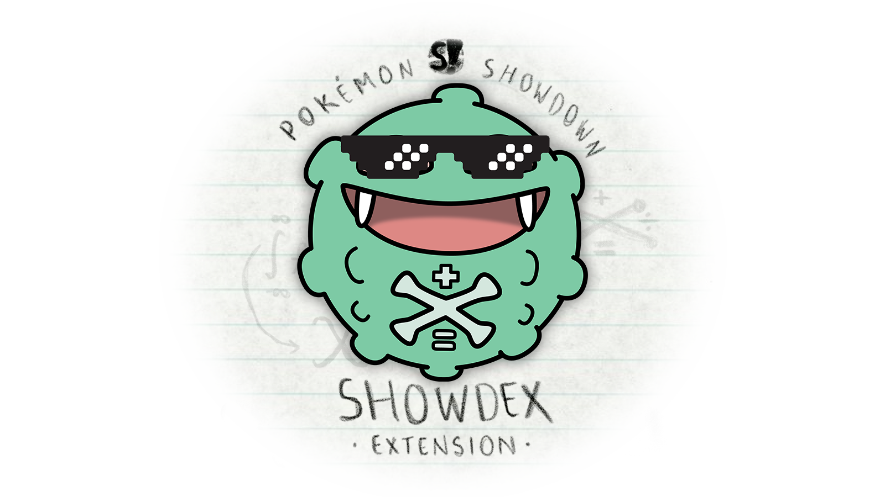

<h1 align="center">
  <code>showdex</code>
</h1>

Current [v1.0.1](https://github.com/doshidak/showdex/releases/tag/v1.0.1) | [Chrome](https://chrome.google.com/webstore/detail/dabpnahpcemkfbgfbmegmncjllieilai) | [Firefox](https://addons.mozilla.org/en-US/firefox/addon/showdex/) | [Smogon Forums](https://www.smogon.com/forums/threads/showdex-an-auto-updating-damage-calculator-built-into-showdown.3707265/) | [Reddit](https://www.reddit.com/r/pokemonshowdown/comments/x5bi27/showdex_an_autoupdating_damage_calculator_built/) | 
--- | --- | --- | --- | --- | ---

  

**Showdex** is a browser extension for [Pokémon Showdown](https://pokemonshowdown.com) that brings the [Damage Calculator](https://calc.pokemonshowdown.com) you know and love right into your battle! Automatically syncs all Pokémon and field conditions as you play, so you can spend *less time* shitting brix and *more time* [hitting kicks](https://www.smogon.com/dex/ss/moves/high-jump-kick).

> **Note**  
> Supported on [**Chrome**](https://chrome.google.com/webstore/detail/dabpnahpcemkfbgfbmegmncjllieilai) & [**Firefox**](https://addons.mozilla.org/en-US/firefox/addon/showdex/). No support for browsers on **Android** at the moment.  
> Apparently also works on [**Opera GX**](https://www.smogon.com/forums/threads/showdex-an-auto-updating-damage-calculator-built-into-showdown.3707265/post-9326569), [**Brave**](https://www.smogon.com/forums/threads/showdex-an-auto-updating-damage-calculator-built-into-showdown.3707265/post-9326696) & any other browser that supports Chrome Extensions.

## What's Cookin'

* [**Planned Features**](https://github.com/users/doshidak/projects/1)
* [**Known Issues**](https://github.com/users/doshidak/projects/2)

## Developer SparkNotes™

> **Warning**  
> This technical document is of a technical nature.  
> For the non-technical document of a non-technical nature, please visit the [**Smogon Forums post**](https://www.smogon.com/forums/threads/showdex-an-auto-updating-damage-calculator-built-into-showdown.3707265/).

> **Note**  
> This section is a work-in-progress.

This extension is written in **TypeScript**, which is essentially JavaScript on crack, using:

* **React** for the UI frontend (e.g., [Hellodex](./src/pages/Hellodex/Hellodex.tsx), [Calcdex](./src/pages/Calcdex/Calcdex.tsx)),
* **Redux** for global state management (e.g., [Calcdex state](./src/redux/store/calcdexSlice.ts)),
* [**RTK Query**](https://redux-toolkit.js.org) for global data management (e.g., [downloaded Smogon sets](./src/redux/services/presetApi.ts)),
* **Babel** for TypeScript transpilation (in lieu of [`tsc`](https://www.typescriptlang.org/docs/handbook/compiler-options.html)),
* **ESLint** for *suggestive* code linting, and
* **webpack** for chunking & bundling.

### Requirements

* **`node`** v18.0.0+
* **`yarn`** (Classic) v1.22.0+
* **`bash`** ([Windows WSL](https://docs.microsoft.com/en-us/windows/wsl/install), macOS, or Linux)

### Setup

> **Note**  
> These instructions are for building the extension from **source**.  

1. `cd` into your favorite directory.
2. `git clone git@github.com:doshidak/showdex.git`
3. `cd showdex`
4. `yarn`

#### Auto-Patching

Each time you run `yarn` (including `yarn add` & `yarn remove`), the [**`postinstall`**](./package.json#L26) script will **automatically** run afterwards, which itself runs the following:

  

    <strong><code>yarn patch-ghooks</code></strong>
  

  > This project is configured for **ES Modules** (as opposed to ye olde **CommonJS**), while also making use of [`cz-customizable`](https://github.com/leoforfree/cz-customizable), which requires [`cz-customizable-ghooks`](https://github.com/uglow/cz-customizable-ghooks), which requires [**`ghooks`**](https://github.com/ghooks-org/ghooks).
  >
  > Node v18 doesn't allow you to run extensionless files (such as `.git/hooks/commit-msg`), which `ghooks` poops out, so [**`patch-ghooks`**](./scripts/patch-ghooks.sh) adds `.js` at the end of each pooped out file (e.g., `.git/hooks/commit-msg.js`).
  >
  > Otherwise, Node will complain about running an extensionless file and critically fail when you attempt to make a `git commit`.

  

    <strong><code>yarn patch-package</code></strong>
  

  > This runs [**`patch-package`**](https://github.com/ds300/patch-package), which reads from the [**`patches`**](./patches) directory and applies the `diff` to the corresponding package in *your* `node_modules`.
  >
  > Currently, the package being patched is [**`@smogon/calc`**](https://github.com/smogon/damage-calc/tree/master/calc), which actually performs the monster mathematics under-the-hood to produce the displayed damage ranges. Its [npm page](https://www.npmjs.com/package/@smogon/calc) shows the [last v0.6.0 release](https://www.npmjs.com/package/@smogon/calc/v/0.6.0) was published 2 years ago (as of September 2022). Since then, the package's GitHub had received many updates and bug fixes that are unpublished to npm.
  >
  > To bring the locally-installed `@smogon/calc` up-to-speed with the latest changes (most notably the fixes for *Psyshock* and *Photon Geyser*), the [included patch for `@smogon/calc`](./patches/%40smogon%2Bcalc%2B0.6.0.patch) will apply all the pushed changes on the GitHub up to the [latest `efa6fe7` commit](https://github.com/smogon/damage-calc/tree/efa6fe7c9d9f8415ea0d1bab17f95d7bcfbf617f/calc).

#### Browser

> **Note**  
> If your browser is already configured to load locally-built extensions, you can skip this part.

You'll need to apply some slight tweaks to your browser for it to load locally-built extensions.

  

    <strong>Google Chrome</strong>
  

  1. Navigate to the **Chrome extensions** page (`chrome://extensions`).
  2. Enable **Developer mode** in the top-right corner.
  3. Verify that the **Load unpacked** option is available.

  

    <strong>Mozilla Firefox</strong>
  

  1. Navigate to the **Advanced Preferences** page (`about:config`).
  2. Search for the preference `xpinstall.signatures.required`.
  3. Set the preference's value to `false` (typically `true` by default).
  4. Navigate to the **Debugging** page (`about:debugging`).
  5. Select **This Firefox** on the left-hand panel.
  6. Verify that the **Temporary Extensions** section and the **Load Temporary Add-on...** option are available.

### Development

> **Note**  
> When viewing the console, you may notice a lot of debug logs, which will only exist on development.

1. `cd showdex`
2. `yarn dev:chrome` or `yarn dev:firefox`

Built contents will be dumped into a **`build` directory** in the project root (will be created if it doesn't exist).

1. Navigate to your browser's extensions page:
  - On **Chrome**, navigate to `chrome://extensions`.
  - On **Firefox**, navigate to `about:debugging`.
2. Select your browser's **Load** option.
3. Point to the correct build depending on your browser:
  - On **Chrome**, point to the `chrome` sub-directory in `build`.
  - On **Firefox**, point to the `showdex-...-dev.firefox.xpi` file in `build`.
4. Verify the extension appears in the list.
  - On **Firefox**, you should also see the extension in `about:addons`, under **Extensions**.
5. Navigate to [Pokémon Showdown](https://play.pokemonshowdown.com).
6. Play or spectate a battle.

#### Hot-Reloading

> **Note**  
> Recommended you develop on **Chrome** since the reloading process for other browsers such as **Firefox** may be very inconvenient.

> **Warning**  
> Hot-reloading is a bit of a mess right now since it requires you to reload the extension and refresh Pokémon Showdown. Will figure out a better system in the future.

While `yarn dev` is running, Webpack will trigger a re-compilation of the bundle when files are changed in the [`src`](./src) directory.

* For **Chrome**, you'll need to select the **reload icon** button in the **Chrome extensions** page (`chrome://extensions`). Once reloaded, **refresh** Pokémon Showdown to see your changes.
* For **Firefox**, you'll need to **Remove** the extension in the **Debugging** page (`about:debugging`), then **Load Temporary Add-on...** to the newly packaged `xpi` file. Once re-added, **refresh** Pokémon Showdown to see your changes.
  - Note that you cannot simply **Reload** the extension since the packaged `xpi` file will have a different file name.

### Building

1. `cd showdex`
2. `yarn build:chrome` or `yarn build:firefox`

Built contents will be dumped into a **`dist` directory** in the project root (will be created if it doesn't exist).

There will be an un-zipped directory named after the `BUILD_TARGET` env (e.g., `chrome`, `firefox`) containing all the bundled files, as well as:

* For **Chrome**, a packaged extension under `showdex-...chrome.zip` in `dist`, and
* For **Firefox**, a packaged extension under `showdex-...firefox.xpi` in `dist`.

Courtesy of [AMO by Mozilla](https://addons.mozilla.org), every build now comes with its very own bundle size pie chart, showing you exactly which unchunked packages in the bundle are too **thicc**.

* Bundle size analysis is written to `showdex-...[BUILD_TARGET].html` in `dist`.

### Contributing

> **Note**  
> This repo doesn't have any fancy CI integrations at the moment. Additionally, since this project doesn't use `tsc`, your code will still compile even if you have TypeScript or ESLint errors.

**(ﾉ◕ヮ◕)ﾉ\*:･ﾟ✧** Issues & PRs (Pull Requests) are **very** welcome! **✧ﾟ･: \*ヽ(◕ヮ◕ヽ)**

I'm not a stickler for how these should be formatted; just make sure you provide enough info for me to work off of.

However, just for PRs, please:

* **Fork** this repo and **commit** changes to your fork,
* **Style** your code according to the [**ESLint rules**](./.eslintrc.json),
* **Create** a PR from your fork to this repo, and
* **Provide** a brief description of your changes in your PR.

Thanks! &hearts;

## How It's Made™

> **Note**  
> This section is a work-in-progress.

uhhhhhhhhh

## Credits

> **Note**  
> This work-in-progress is a section.

big thank to:

* [**camdawgboi**](https://pokemonshowdown.com/users/camdawgboi) for the idea and UI/UX design,
* [**ttoki**](https://pokemonshowdown.com/users/ttoki) for being our first tester,
* [**pkmn.cc**](https://pkmn.cc) for keeping the Smogon sets hot and fresh and downloadable,
* **Austin** for the validation and support,
* **Honko** for the original damage calculator,
* **Zarel** and the [**Showdown Staff & Contributors**](https://pokemonshowdown.com/credits) for this would literally be nothing without them,
* **Game Freak** and **Nintendo** for good game (plz don't sue us lol), and
* [**sumfuk**](https://pokemonshowdown.com/users/sumfuk) ???
